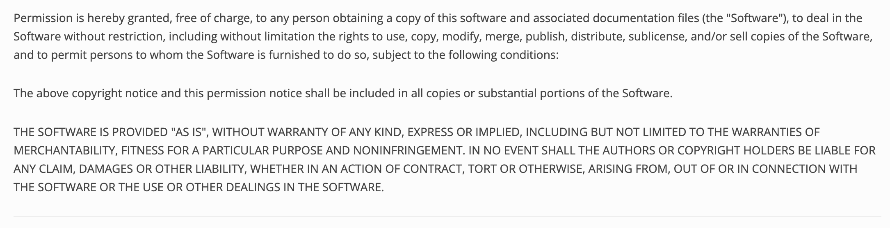

# dreamteam

    

## Description
    
    This app is a Node.js command-line application that takes in information about employees on a software engineering team and generates an HTML webpage that displays summaries for each person.

## Table of Contents

    
- [Installation](#installation) 
- [Usage](#usage) 
- [Licenses](#licenses) 
- [Contribute](#contribute) 
- [Testing](#testing) 
- [Questions](#questions)

    
## Installation
    
    Git clone the repo to ypur workstation

## Usage

    You will need to install and run 'node dreamteam.js'

  [Video usage guide](https://drive.google.com/file/d/16bqPTdSVKrAoVJY_rAZH_L5J8Z5MJxlF/view)

## Licenses

    

MIT License

## Contribute

    Git clone repo and submit a pull request, merge will be reviewed and potentially merged.

## Testing

    You will jest test using 'npm test', jest will need to be installed as a dependency. 

## Questions
 

Please reach out via Github: https://github.com/jshvaron or create an issue on the correlating repo page. For any further communication, please email me: noemail@mail.com.

